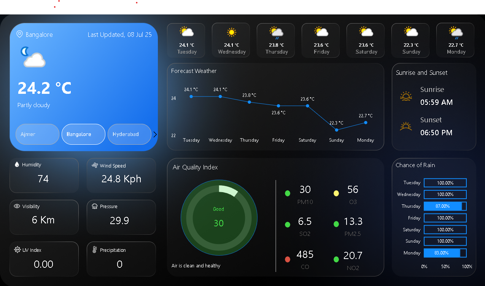

# 🌦️ Real-Time Weather Dashboard using Power BI

This project showcases a real-time weather dashboard built in **Power BI**, using live data fetched from a **Weather API**.

---
## 📌 Overview

This project demonstrates the use of **Power BI** to visualize **real-time weather data** by connecting to a live weather API via the web connector.

The dataset includes key atmospheric metrics such as:
- **Temperature (°C)**
- **Humidity (%)**
- **Wind Speed (km/h)**
- **Pressure (hPa)**
- **Visibility (km)**
- **Cloud Cover (%)**
- **Weather Description** (e.g., Clear, Rainy, Cloudy)

The dashboard connects to a live API and can be refreshed to display the most recent weather conditions automatically.  
It monitors **real-time weather in 6 selected Indian cities**, making it valuable for localized weather tracking.

> **Cities included**: Bangalore, Mumbai, Hyderabad, Lucknow, Ajmer, and Noida.

This dashboard is particularly useful for industries such as **travel, agriculture, logistics**, and **city planning**, where real-time weather insights are crucial for operations and decision-making.

---
## 🧠 Insights

The dashboard offers visibility into:
- Current weather conditions at a glance  
- Temperature trend over time  
- Humidity and comfort index  
- Wind speed & direction monitoring  
- Pressure & storm indicators  
- Visibility conditions  
- Cloud cover & weather type  
- Multi-city comparison  
- Real-time weather alerts  

---
## ⚙️ Tools & Technologies

- Power BI Desktop  
- API Integration (`Web` connector)  
- Data Modeling using Power Query  
- Custom Measures and KPIs using **DAX (Data Analysis Expressions)**

---
## 🧮 DAX Measures Used

Custom measures were created using **DAX** to calculate key metrics and apply dynamic visuals. These include:

- **AQI Status & Suggestions** – Text indicators and health messages based on Air Quality Index  
- **Pollutant Colors (CO, NO2, O3, PM10, PM2.5, SO2)** – Color-coded measures for easy visualization of pollutant levels  
- **Temperature Measures** – Current and forecasted temperatures for comparison  
- **Visibility & Wind Speed** – Environmental conditions per city  
- **Last Updated Time** – Display of latest refresh timestamp  
- **Custom KPIs & Max Values** – Used to drive slicers, cards, and conditional logic in visuals  

These DAX measures helped create a more interactive and insightful weather dashboard.

---
## 🔗 Live Data Source

- **API Provider**: [WeatherAPI.com](https://www.weatherapi.com/)] 
- **Method**: URL imported into Power BI using `Web` connector
- **Refresh**: Manual or Scheduled refresh available via Power BI Service

---
## 📦 Dataset Construction

The dataset used in this project was created by combining weather data for six Indian cities:  
**Ajmer, Bangalore, Mumbai, Hyderabad, Lucknow, and Noida**, using WeatherAPI.

- The initial dataset was pulled from the **WeatherAPI** using the **Web connector** in Power BI for the city of **Ajmer**.
- This dataset served as the base to understand the API structure and weather metrics.
- After confirming the schema, **Power Query functions and parameters** were used to dynamically fetch weather data for other cities directly in Power BI.
- These individual responses were merged into a single **`Weather_MasterTable.csv`** file.
- This master dataset contains all current and forecast weather details for each city.
- From this `Weather_MasterTable.csv`, the following datasets were created within Power BI (via Power Query):
  - `Current` – Current weather data per city
  - `Forecast_Day` – Daily forecasts
  - `Forecast_Hour` – Hourly forecasts
  - `Locations` – Metadata for each location

Only `Weather_MasterTable.csv` is included in this repository to avoid redundancy.  
All other tables were created within Power BI using **Power Query** and **DAX**.

---
## 🖼️ Dashboard Preview




---
## 📂 Project Structure
```
Weather-Dashboard/
│
├── WeatherAPI.pbix
├── README.md
├── Datasets/
│ ├── Weather_MasterTable.csv
├── Images/
│ └── dashboard.png
```

---
## 📬 Contact

**Aishwarya SR**  

📧 aishwaryasr097@gmail.com 

🔗 [LinkedIn](https://www.linkedin.com/in/aishwarya-sr/)  

💻 [GitHub](https://github.com/Aiishwarya01)
